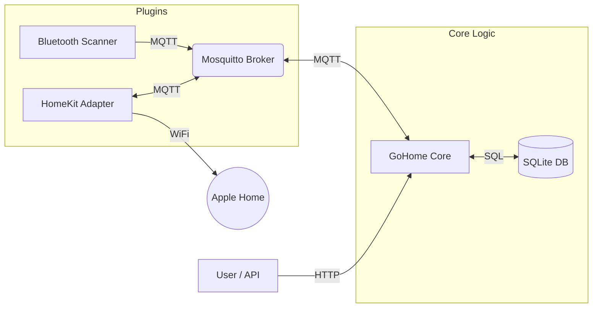

# :material-home-automation: Welcome to GoHome

**go-home**  is a lightweight, modular bridge for smart home devices, written in Go. It is designed to be fast, resource-efficient, and easy to deploy using Docker.

## :material-server-network: Architecture
The system relies on a decoupled architecture using MQTT for communication between the Core and its Plugins.

## :material-toy-brick: Components

The ecosystem consists of two main parts:
1) Core Service: The brain of the operation. It manages state, logic, and the API.
2) Plugins: Microservices that act as adapters (Bluetooth, HomeKit, Zigbee, etc.) and communicate via MQTT.

## :material-rocket-launch: Getting Started

👉 **Ready to start? Go to the [Installation](installation.md){ .md-button .md-button--primary } page.**